  

  
  
  

 

## About

Data and AI Engineer. Six years across banking, insurance, and healthcare. Currently working where data meets LLMs: retrieval, agent orchestration, and the schema discipline both depend on. Databricks and Snowflake for the platform, LangGraph and QLoRA for the layer above it.

| | |
|:--|:--|
| **Building** | Multi-agent, AI-native systems that hold up in production, not just in a demo |
| **Learning** | LLM evaluation frameworks, agent tracing, governance for systems on production data |
| **Ask me about** | Spark architecture, when RAG is the wrong answer, fine-tuning vs prompting |
| **Based in** | San Jose, CA |

> *Every failed agent I have debugged failed at the data layer, not the model layer.*

 

## Selected Work

<b>Hiring Agents That Read Between the Lines</b> &nbsp;·&nbsp; <code>LangGraph</code> <code>QLoRA</code> <code>vLLM</code>

 

A multi-agent recruiting system covering resume screening, structured extraction, and natural-language querying over candidate data.

Four open-weight models (Gemma 2, Llama 3.1, Qwen 2.5, Mistral) fine-tuned with QLoRA on 4-bit NF4 quantization and benchmarked head to head, then served through vLLM with paged attention for throughput. Retrieval runs on Qdrant with hybrid search. State moves between agents as a typed graph, so a failure traces to a node rather than to a prompt.

**99%** shortlisting accuracy &nbsp;·&nbsp; **73%** NL-to-SQL exact match &nbsp;·&nbsp; **under 4s** p95 latency

`LangGraph` `QLoRA` `vLLM` `Qdrant` `FastAPI` `Supabase`

<b>Retrieval That Survives Bad Questions</b> &nbsp;·&nbsp; <code>FAISS</code> <code>CLIP</code> <code>Cross-Encoder</code>

 

A multimodal RAG pipeline for macroeconomics QA, where the answer often lives in a chart rather than the surrounding text.

Dense FAISS vectors fused with BM25 lexical scores to catch the exact-figure queries embeddings miss, CLIP embeddings to bring chart images into the same retrieval space, and a cross-encoder reranking pass over the top-k before generation. LLaMA 3 on Groq keeps the reranking budget affordable.

Benchmark score lifted from **0.28 to 0.42**

`FAISS` `BM25` `CLIP` `Cross-Encoder` `LLaMA 3` `Groq`

<b>Eight Hours to Under Three</b> &nbsp;·&nbsp; <code>PySpark</code> <code>Databricks</code> <code>Snowflake</code>

 

Risk and liquidity reporting for a derivatives book, rebuilt around how Spark actually moves data rather than how the DAG looked on paper.

Diagnosed skew from the physical plan, repartitioned on a salted join key, replaced wide shuffles with broadcast joins where cardinality allowed, and cached the reused intermediate frames. Paired with a Snowflake migration of 70M+ records and Autosys orchestration for the nightly window.

Batch runtime cut from **8 hours to under 3**

`PySpark` `Databricks` `Delta Lake` `Snowflake` `Autosys`

<b>A Lakehouse Fluent in Healthcare</b> &nbsp;·&nbsp; <code>Snowflake</code> <code>dbt</code> <code>Airflow</code>

 

A Medallion-architecture platform for pharmacy benefit and claims data, built so clinical coding stays queryable instead of collapsing into strings.

Bronze ingestion from PBM APIs, silver standardization of 835/837 EDI alongside SNOMED CT, CPT, LOINC, and ICD-10 vocabularies, gold star schemas modeled in dbt and orchestrated by Airflow. Power BI semantic models sit on top in Direct Lake mode, with a Microsoft Fabric Copilot agent for self-serve questions.

HIPAA-aligned &nbsp;·&nbsp; oncology and RLT domain

`Snowflake` `dbt` `Airflow` `Microsoft Fabric` `Power BI`

 

## Stack

<b>Tools I reach for</b>

 

**Languages** &nbsp;

**Platform** &nbsp;

**AI** &nbsp;

**Cloud** &nbsp;

**Analytics** &nbsp;

 

## Activity

<b>GitHub stats</b>

 

  
  

  

