  

Data and AI Engineer. Six years across banking, insurance, and healthcare. Currently working where data meets LLMs: retrieval, agent orchestration, and the schema discipline both depend on. Databricks and Snowflake for the platform, LangGraph and QLoRA for the layer above it.

| | |
|:--|:--|
| **Building** | Multi-agent, AI-native systems that hold up in production, not just in a demo |
| **Learning** | LLM evaluation frameworks, agent tracing, governance for systems on production data |
| **Ask me about** | Spark architecture, when RAG is the wrong answer, fine-tuning vs prompting |
| **Based in** | San Jose, CA |

## Selected Work

> [!IMPORTANT]
> ### Hiring Agents That Read Between the Lines
> **A multi-agent recruiting system covering resume screening, structured extraction, and natural-language querying over candidate data.**
>
> Four open-weight models (Gemma 2, Llama 3.1, Qwen 2.5, Mistral) fine-tuned with QLoRA on 4-bit NF4 quantization and benchmarked head to head, then served through vLLM with paged attention. Retrieval runs on Qdrant with hybrid search. State moves between agents as a typed graph, so a failure traces to a node rather than to a prompt.
>
> `99% shortlisting accuracy` `73% NL-to-SQL exact match` `sub-4s p95`
>
> `LangGraph` `QLoRA` `vLLM` `Qdrant` `FastAPI` `Supabase`

> [!TIP]
> ### Retrieval That Survives Bad Questions
> **A multimodal RAG pipeline for macroeconomics QA, where the answer often lives in a chart rather than the surrounding text.**
>
> Dense FAISS vectors fused with BM25 lexical scores to catch the exact-figure queries embeddings miss, CLIP embeddings to bring chart images into the same retrieval space, and a cross-encoder reranking pass over the top-k before generation. LLaMA 3 on Groq keeps the reranking budget affordable.
>
> `benchmark score 0.28 to 0.42`
>
> `FAISS` `BM25` `CLIP` `Cross-Encoder` `LLaMA 3` `Groq`

> [!NOTE]
> ### Eight Hours to Under Three
> **Risk and liquidity reporting for a derivatives book, rebuilt around how Spark actually moves data rather than how the DAG looked on paper.**
>
> Diagnosed skew from the physical plan, repartitioned on a salted join key, replaced wide shuffles with broadcast joins where cardinality allowed, and cached the reused intermediate frames. Paired with a Snowflake migration of 70M+ records and Autosys orchestration for the nightly window.
>
> `batch runtime 8h to under 3h` `70M+ records migrated`
>
> `PySpark` `Databricks` `Delta Lake` `Snowflake` `Autosys`

> [!WARNING]
> ### A Lakehouse Fluent in Healthcare
> **A Medallion-architecture platform for pharmacy benefit and claims data, built so clinical coding stays queryable instead of collapsing into strings.**
>
> Bronze ingestion from PBM APIs, silver standardization of 835/837 EDI alongside SNOMED CT, CPT, LOINC, and ICD-10 vocabularies, gold star schemas modeled in dbt and orchestrated by Airflow. Power BI semantic models sit on top in Direct Lake mode, with a Microsoft Fabric Copilot agent for self-serve questions.
>
> `HIPAA-aligned` `oncology and RLT domain`
>
> `Snowflake` `dbt` `Airflow` `Microsoft Fabric` `Power BI`

## Stack

## Analytics

 

  

<table border="0">
<tr>
<td>

</td>
<td>

</td>
</tr>
</table>

 

<!-- START_SECTION:activity -->
<!-- END_SECTION:activity -->

<!-- START_SECTION:content -->
<!-- END_SECTION:content -->

<code>SYSTEM.READY // tejashreebadve</code>

